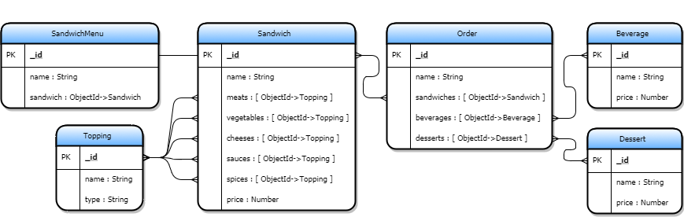

# Sandwich Shop API
This API fulfills the requirements set by the [Custom API Weekend Lab (Week 4)](https://github.com/wdi-atx-12/custom-api) assignment.

## Overview
Any sandwich shop will have many different types of food stuff for sale. This particular sandwich shop sells a variety of Sandwiches, Beverages, and Desserts. With our handy Sandwich Menu, we allow for easy access to our most popular Sandwiches. All of our Toppings are to die for. You can have as many Meats, Vegetables, Cheeses, Sauces, and Spices as you desire. This README assumes that you have a rudimentary understanding of [Postman](https://www.getpostman.com/docs/postman/sending_api_requests/requests).

## Model/Schema
The diagram below shows each models' relationships


## Models/Schemas w/out References: Dessert, Beverage, and Topping
Each of these models are basic and do not contain any references to any other model. They are all share the same basic functionality. For any of the endpoints, you can use https://mighty-shore-62612.herokuapp.com for the time being.

### Endpoint 1: Select All (GET)
To get the JSON of all the items in **Dessert**, **Beverage**, or **Topping**, add one of the following to the site's root address.
```javascript
GET => /api/desserts
GET => /api/beverages
GET => /api/toppings
```

### Endpoint 2: Select One Item By ID (GET)
To get the JSON of a single item in **Dessert**, **Beverage**, or **Topping**, add one of the following to the site's root address. Use the corresponding **Endpoint 1** to get a valid id and replace `:id`.
```javascript
GET => /api/desserts/:id
GET => /api/beverages/:id
GET => /api/toppings/:id
```

### Endpoint 3: Create/Insert A New item (POST)
To add a single item to **Dessert**, **Beverage**, or **Topping**, add one of the following to the site's root address.
```javascript
POST => /api/desserts/
POST => /api/beverages/
POST => /api/toppings/
```
```json
//Sample POST request for adding a new Dessert
{
	"name": "lemon tart",
	"price": 2.50
}

//Sample POST request for adding a new Beverage
{
	"name": "diet coke",
	"price": 0.99
}

//Sample POST request for adding a new Topping*
{
	"name": "pickle",
	"type": "vegetable"
}
```
Note that valid values for **Topping.type** are "meat", "vegetable", "cheese", "sauce", "spice".

### Endpoint 4: Update/Modify An Existing item (PUT)
To update a single item in **Dessert**, **Beverage**, or **Topping**, add one of the following to the site's root address. You can use the corresponding **Endpoint 1** or **Endpoint 3** to get a valid id and replace `:id`.
```javascript
PUT => /api/desserts/:id
PUT => /api/beverages/:id
PUT => /api/toppings/:id
```
```json
//Sample PUT request for updating an existing Dessert
{
	"name": "raspberry tart",
	"price": 3.00
}

//Sample PUT request for updating an existing Beverage
{
	"name": "coke zero",
	"price": 0.99
}

//Sample PUT request for updating an existing Topping*
{
	"name": "grated parmesan",
	"type": "spice"
}
```
Note that valid values for **Topping.type** are "meat", "vegetable", "cheese", "sauce", "spice".

### Endpoint 5: Delete/Remove An Existing item (DELETE)
To delete a single item in **Dessert**, **Beverage**, or **Topping**, add one of the following to the site's root address. You can use the corresponding **Endpoint 1** or **Endpoint 3** to get a valid id and replace `:id`.
```javascript
DELETE => /api/desserts/:id
DELETE => /api/beverages/:id
DELETE => /api/toppings/:id
```

## Models/Schemas With References: Sandwich, SandwichMenu, and Order
Each of these models have at least one reference to another model. They are all share the same basic functionality. For any of the endpoints, you can use https://mighty-shore-62612.herokuapp.com for the time being.

### Endpoint 1: Select All (GET)
To get the JSON of all the items in **Sandwich**, **SandwichMenu**, or **Order**, add one of the following to the site's root address.
```javascript
GET => /api/sandwichs  //(misspelled)
GET => /api/sandwichmenus
GET => /api/orders
```

### Endpoint 2: Select One Item By ID (GET)
To get the JSON of a single item in **Sandwich**, **SandwichMenu**, or **Order**, add one of the following to the site's root address. Use the corresponding **Endpoint 1** to get a valid id and replace `:id`.
```javascript
GET => /api/sandwichs/:id
GET => /api/sandwichmenus/:id
GET => /api/orders/:id
```

### Endpoint 3: Create/Insert A New item (POST)
To add a single item to **Sandwich**, **SandwichMenu**, or **Order**, add one of the following to the site's root address.
```javascript
POST => /api/sandwichs/
POST => /api/sandwichmenus/
POST => /api/orders/
```
```json
//Sample POST request for adding a new Sandwich
{
	"name": "basic turkey without sauces",
	"breadType": "white",
	"meats": ["Topping.ObjectId" , "Topping.ObjectId"],
	"vegetables": ["Topping.ObjectId" , "Topping.ObjectId"],
	"cheeses": ["Topping.ObjectId"],
	"sauces": [],
	"spices": ["Topping.ObjectId"],
	"price": 3.99
}

//Sample POST request for adding a new SandwichMenu item
{
	"name": "standard turkey breast",
	"sandwich": "Sandwich.ObjectId"
}

//Sample POST request for adding a new Order*
{
	"name": "Jay",
	"sandwiches": ["Sandwich.ObjectId"],
	"desserts": ["Dessert.ObjectId"],
	"beverages": ["Beverage.ObjectId"]
}
```
Note that valid values for each of the arrays are `ObjectIds` that exist as an item in the corresponding Model/Schema.

### Endpoint 4: Update/Modify An Existing item (PUT)
To update a single item in **Sandwich**, **SandwichMenu**, or **Order**, add one of the following to the site's root address. You can use the corresponding **Endpoint 1** or **Endpoint 3** to get a valid id and replace `:id`.
```javascript
PUT => /api/sandwichs/:id
PUT => /api/sandwichMenus/:id
PUT => /api/orders/:id
```

```json
//Sample PUT request for updating a Sandwich
{
	"name": "basic turkey without sauces",
	"breadType": "wheat",
	"meats": ["Topping.ObjectId" , "Topping.ObjectId"],
	"vegetables": ["Topping.ObjectId" , "Topping.ObjectId"],
	"cheeses": ["Topping.ObjectId"],
	"price": 5.99
}

//Sample PUT request for updating a SandwichMenu item
{
	"name": "super turkey breast"
}

//Sample PUT request for updating a Order*
{
	"name": "Jay",
	"sandwiches": ["Sandwich.ObjectId"],
	"desserts": ["Dessert.ObjectId"],
	"beverages": ["Beverage.ObjectId"]
}
```
Note that valid values for **Sandwich.type** are "white", "wheat", "sourdough", "flatbread", "jalapeno cheddar".

### Endpoint 5: Delete/Remove An Existing item (DELETE)
To delete a single item in **Sandwich**, **SandwichMenu**, or **Order**, add one of the following to the site's root address. You can use the corresponding **Endpoint 1** or **Endpoint 3** to get a valid id and replace `:id`.
```javascript
DELETE => /api/sandwichs/:id
DELETE => /api/sandwichmenus/:id
DELETE => /api/orders/:id
```

## Future
This section will be filled in soon.
