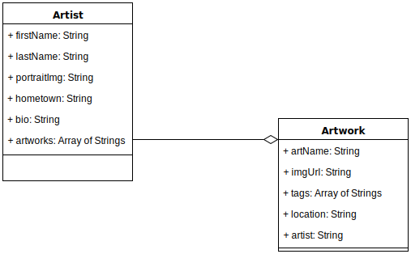

# Famous Artworks API

The famous artworks API is a database driven JSON API that maps Famous artworks and their locations to data about the artist that created them.


## Heroku Hosted Solution
You can find the API hosted on heroku at the following url.  There is no front end layer for the API at this time, so the below End Points will assist in navigating it's database. 
https://damp-mesa-41370.herokuapp.com/

## API DATA MODEL
References are not created automatically with this version of the API. Therefore Reference keys in both Artist and Artwork must be added via a PUT on each model respectively.




## API End Points


### Get Artists
* method: GET
* path: https://damp-mesa-41370.herokuapp.com/artist
* description: returns a result of all current Artist Records as JSON.

### Get A Specific Artist
* method: GET
* path: https://damp-mesa-41370.herokuapp.com/artist/<<_id here>>
* description: returns a result of a specific artist as JSON.

### Create An Artist
* method: POST
* path: https://damp-mesa-41370.herokuapp.com/artist
* description: creates a new artist record, required input as JSON will include:
```{
  "firstName": "Artist's First Name here",
  "lastName": "Artist's Last Name here",
  "portraitImg": "http://www.hostedurlexample.com/artist-portrait.jpg",
  "hometown": "City, State",
  "bio": "artist bio typed here",
  "Artwork": [""]
}```

### Delete a specific artist
* method: DELETE
* path: https://damp-mesa-41370.herokuapp.com/artist/<<_id here>>**
* description: recalls an existing Artwork record and removes it from the database.


### Get All Artworks
* method: GET
* path: https://damp-mesa-41370.herokuapp.com/artwork
* description: returns a result of all current Artwork Records as JSON.

### Create An Artwork
* method: POST
* path: https://damp-mesa-41370.herokuapp.com/artwork
* description: creates a new artwork record, required input as JSON will include the following
```{
  "artName": "Mona Lisa",
  "imageUrl": "https://upload.wikimedia.org/retouched.jpg",
  "tags": [""],
  "location": "Paris, France",
  "artist": ""
}```

### Update A Specific Artwork
* method: PUT
* path: https://damp-mesa-41370.herokuapp.com/artwork/<<_id here>>**
* description: recalls an existing Artwork record and is able to update any specific value within it's schema. The following example will update the records location:
```{
  "location": "Barcelona, Spain"
}```

### Delete a specific artwork
* method: DELETE
* path: https://damp-mesa-41370.herokuapp.com/artwork/<<_id here>>
* description: recalls an existing Artwork record and removes it from the database.
